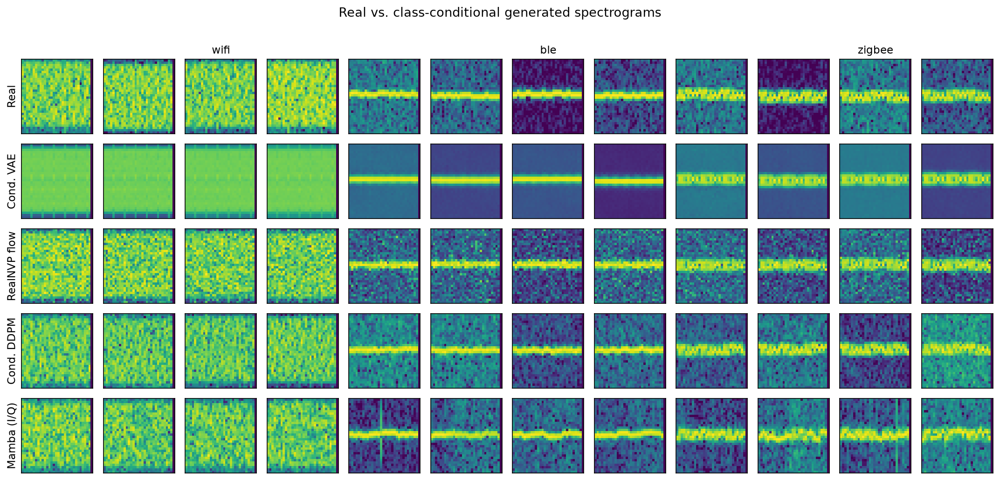
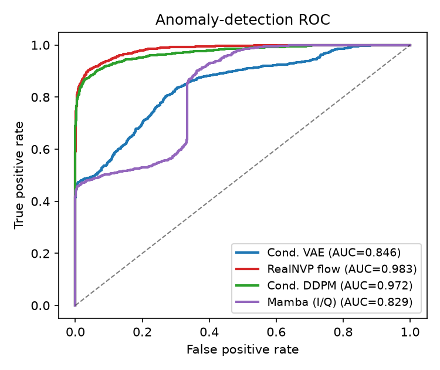

# RF-GenLab — Deep Generative Models for Synthetic RF Signals and Anomaly Detection

**ECE 1508 final project** 

**Tristan Ruel (1012867710)**

RF-GenLab studies whether deep generative models can learn the distribution of
valid wireless signals well enough to (a) **generate** realistic class-conditional
samples and (b) **detect** signals that do not match the learned distribution
(noisy, corrupted, or protocol-inconsistent transmissions). It compares three
conditional generative models from three different families on a fully
reproducible synthetic RF dataset:

| Family | Model | Domain |
|---|---|---|
| Latent-variable | **Conditional VAE** | spectrogram |
| Explicit maximum-likelihood | **Conditional RealNVP normalising flow** | spectrogram |
| Denoising / diffusion | **Conditional DDPM** | spectrogram |
| Autoregressive (explicit likelihood) | **Conditional Mamba SSM** | raw I/Q sequence |

Signals cover three 2.4 GHz-band protocol families: **Wi-Fi (OFDM)**,
**Bluetooth Low Energy (GFSK)**, and **ZigBee (O-QPSK/DSSS)**. The three
spectrogram models share a `1×32×32` log-magnitude STFT representation; the
**Mamba** model instead operates autoregressively on the mu-law-tokenised raw
I/Q sequence, adding a fourth, sequence-domain point to the comparison.

---

## Results


| Model | Family | Anomaly AUC | Anomaly AP | Gen. acc. | Fréchet ↓ | Likelihood |
|---|---|---|---|---|---|---|
| Conditional VAE | latent-variable | 0.846 | 0.869 | 1.000 | 0.175 | 0.728 bpd (ELBO bound) |
| **RealNVP flow** | explicit likelihood | **0.983** | **0.985** | 1.000 | 0.235 | −1.486 bpd (exact) |
| Conditional DDPM | denoising | 0.972 | 0.977 | 1.000 | **0.157** | 0.103 denoise MSE |
| Mamba (I/Q) | autoregressive | 0.829 | 0.842 | 1.000 | 2.530 | 5.399 bpd (exact discrete) |

**Anomaly-detection AUC by corruption type**

| Model | heavy_noise | freq_shift | timing_corrupt | protocol_mix |
|---|---|---|---|---|
| Conditional VAE | 0.869 | 0.945 | 0.751 | 0.819 |
| RealNVP flow | 0.951 | 1.000 | 0.998 | 0.984 |
| Conditional DDPM | 0.936 | 1.000 | 0.996 | 0.956 |
| Mamba (I/Q) | 0.912 | 0.987 | 0.731 | 0.688 |

**Takeaways:** The explicit-likelihood **flow is the strongest anomaly detector**;
the **DDPM is a close second and produces the most realistic samples** (lowest
Fréchet distance); the **VAE is the cheapest spectrogram model but the weakest
detector** and visibly over-smooths its samples. The **Mamba** autoregressive
model which is the only one operating on raw I/Q, generates recognisable class-conditional signals and gives a clean, exact *discrete* likelihood (5.40 bits/dim),
but is a weaker detector (0.829) and lower-fidelity generator here, and is far
costlier to train. Class-conditional generation succeeds for
all four.




*All numbers were produced by `python scripts/run_all.py`. See [`results/summary.md`](results/summary.md).*
---

## Setup

```bash
python -m pip install -r requirements.txt
```

```bash
python scripts/run_all.py
```

Or run each stage individually:

```bash
python -m rfgen.data.build_dataset          # data/dataset.h5
python -m rfgen.train.train_classifier      # auxiliary CNN (for evaluation)
python -m rfgen.train.train_vae             # runs/vae/best.pt
python -m rfgen.train.train_flow            # runs/flow/best.pt
python -m rfgen.train.train_diffusion       # runs/diffusion/best.pt
python -m rfgen.train.train_mamba           # runs/mamba/best.pt  (raw-I/Q autoregressive)
python -m rfgen.eval.anomaly                # anomaly-detection AUC -> results/anomaly_metrics.json
python -m rfgen.eval.generation             # gen. accuracy, Fréchet, likelihood
python -m rfgen.eval.figures                # results/figures/*.png
python -m rfgen.eval.summarize              # results/summary.md
```

## Demo

```bash
python scripts/demo.py                       # prints verdicts, writes results/figures/fig_demo.png
jupyter notebook notebooks/demo.ipynb        # narrated input -> output walkthrough
```

## Tests

```bash
python -m pytest tests/ -q
```

---

## How it works

### Data pipeline (`rfgen.dsp`, `rfgen.data`)
Each example is `num_samples` complex baseband I/Q samples synthesised from
compact, NumPy-only protocol models (OFDM with comb pilots; Gaussian-smoothed
2-FSK; 16-chip DSSS O-QPSK with a half-chip offset), plus bounded nuisance
(healthy-SNR AWGN, small carrier offset, gain). A `nperseg=32`, `hop=16` STFT is
turned into a peak-normalised `1×32×32` log-magnitude spectrogram. **Anomalies**
are valid signals pushed out of distribution four ways: heavy noise, large
frequency shift, broken timing (blanking gaps + spliced chunks), and protocol
mixing. The builder writes a single HDF5 file with train/val/test normal splits
plus a held-out anomaly set (used **only** at test time).

### Models (`rfgen.models`)
All four models are **class-conditional**. The VAE, flow and DDPM share the spectrogram
representation for a fair comparison; the Mamba model is autoregressive over the
raw I/Q token sequence. The anomaly score for an input `x` is `min_y s(x|y)` —
how well `x` matches the *closest* known protocol — using each model's natural
score: negative ELBO (VAE), exact negative log-likelihood (flow), mean denoising
error over a grid of noise levels (DDPM), and exact autoregressive negative
log-likelihood (Mamba). The Mamba selective scan is portable pure PyTorch with an
exact chunked implementation for speed (unit-tested against the naive recurrence).

### Evaluation (`rfgen.eval`)
Anomaly-detection ROC-AUC / AP (overall and per corruption type); generated-
sample classification accuracy and a Fréchet distance in a CNN feature space;
family-appropriate likelihood/reconstruction metrics; and all report figures.

---

